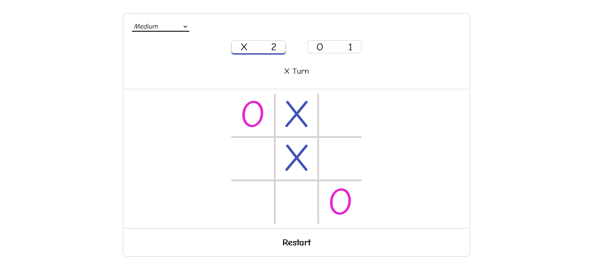
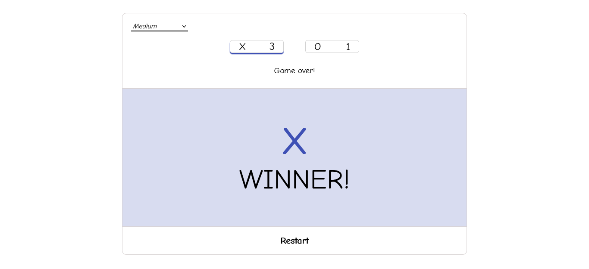

# tic-tac-toe

This is my implementation of the tic-tac-toe game. You can pick from easy, medium, or impossible difficulty and play against an AI, or play with another human.

AI is implemented using the [minimax algorithm](https://en.wikipedia.org/wiki/Minimax).

[Try Demo](https://updatedmyjournal.github.io/tic-tac-toe/)

# Screenshots

